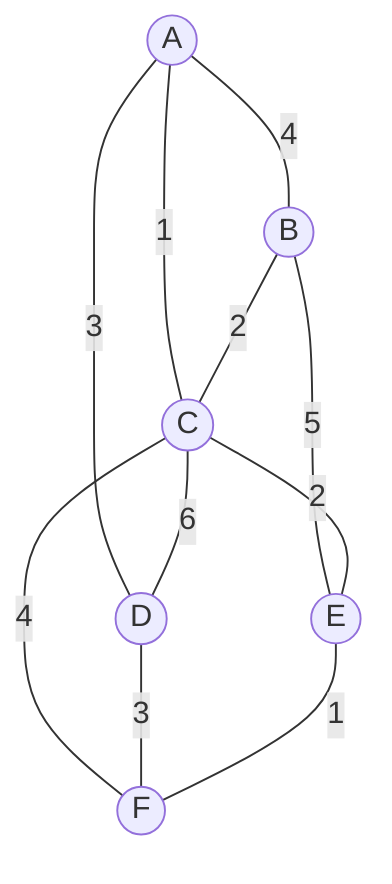

                                                                                                                                        

> [!note] 相关
> 📖 解法指南：[[discrete-math/analysis/解法完全指南_v3|解法指南]]
# 离散数学 模拟试卷 A

> **设计思路：** 强化 Ch4（函数 6分）+ Ch1（逆换式/NAND/XOR 3分）+ Ch2（辖域判定 3分）
> **总分：** 100 分 | **时间：** 120 分钟

---

## 一、不定项选择题（每小题 3 分，共 36 分）

**1.** 设 P:"今天是星期一"，Q:"明天是星期三"，则 P→Q 的逆换式和反换式分别是 **【  】**

A. 若明天是星期三则今天是星期一；若今天不是星期一则明天不是星期三
B. 若明天是星期三则今天是星期一；若明天不是星期三则今天不是星期一
C. 若今天不是星期一则明天不是星期三；若明天是星期三则今天是星期一
D. 若明天不是星期三则今天不是星期一；若今天不是星期一则明天不是星期三

**2.** 下列联结词集合中，是最小联结词组的是 **【  】**

A. {¬, ∧, ∨}
B. {¬, →}
C. {↑}
D. {¬, ∨}

**3.** 公式 ∀x(P(x) → ∃y Q(x,y)) ∨ R(z) 中，关于变元的说法正确的是 **【  】**

A. x 在 P(x) 中约束，在 Q(x,y) 中自由
B. z 是自由变元
C. y 是自由变元
D. 所有变元都被约束

**4.** 设 f:ℝ→ℝ, f(x)=x²；g:ℝ→ℝ, g(x)=x+1。下列正确的是 **【  】**

A. f 是单射
B. g 是满射
C. g∘f 是单射
D. f∘g 是满射

**5.** 设 f:ℝ→ℝ, f(x)=eˣ。下列正确的是 **【  】**

A. f 是满射
B. f 是单射
C. f 是双射
D. f 有逆函数 f⁻¹(x)=ln x

**6.** 设 X={1,2,3}，R 是 X 上的关系，R={⟨1,1⟩,⟨2,2⟩,⟨3,3⟩,⟨1,2⟩,⟨2,1⟩}，则 **【  】**

A. R 是等价关系
B. R 是偏序关系
C. R 的对称闭包 s(R)=R
D. R 的传递闭包 t(R)≠R

**7.** 设 ⟨G,*⟩ 是群，a∈G 的阶为 6，则 a⁴ 的阶是 **【  】**

A. 2
B. 3
C. 4
D. 6

**8.** 设 ⟨{0,1,2,3,4,5}, +₆⟩ 是模 6 加法群，则生成元是 **【  】**

A. 1
B. 2
C. 3
D. 5

**9.** 在模 6 加法群 Z₆ 中，子群 ⟨{0,3},+₆⟩ 的所有不同陪集个数是 **【  】**

A. 1
B. 2
C. 3
D. 6

**10.** 下列哪个是判断简单连通图 G 是欧拉图的充要条件？ **【  】**

A. G 中所有顶点度数为偶数
B. G 中恰有 0 或 2 个奇度顶点
C. G 是哈密尔顿图
D. G 的面数 r < 12

**11.** 连通平面图 G 有 6 个顶点、10 条边，则 G 的面数为 **【  】**

A. 4
B. 5
C. 6
D. 不能用欧拉公式计算

**12.** 下列哪个是判断简单图 G 为哈密尔顿图的**必要条件**？ **【  】**

A. G 中任意顶点度数 ≥ n/2
B. 删去任意 k 个顶点后，连通分支数 ≤ k
C. G 中不含 K₅ 或 K₃,₃ 的细分
D. G 的所有顶点度数之和为偶数

---

## 二、计算题（每小题 8 分，共 32 分）

**13.** 求谓词公式 $\forall x P(x) \to \exists y Q(y)$ 的前束范式。

**14.** 设 $A = \{1,2,3,4,5,6\}$，偏序关系为整除关系。
(1) 画出偏序集 ⟨A, |⟩ 的哈斯图。
(2) 求子集 $B = \{2,3,4\}$ 的极大元、极小元、上界、上确界。

**15.** 设 $G$ 是模 12 加法群 $\langle \mathbb{Z}_{12}, +_{12} \rangle$。
(1) 求 G 的所有子群。
(2) 求子群 $H = \{[0],[4],[8]\}$ 的所有不同陪集。

**16.** 用 Kruskal 算法求下图的最小生成树，画出每一步的子图，计算树权。



---

## 三、证明题（每小题 8 分，共 32 分）

**17.** 用谓词逻辑推理规则证明：
$\forall x(P(x) \to Q(x)), \forall x(Q(x) \to R(x)) \Rightarrow \forall x(P(x) \to R(x))$

**18.** 设 R 是集合 A 上的关系。证明：若 R 是自反的和循环的，则 R 是等价关系。

**19.** 设 H 和 K 都是群 G 的子群。证明：$H \cap K$ 也是 G 的子群。

**20.** 设 G 是简单连通平面图，有 11 个顶点，每个顶点的度数至少为 5。证明：G 不可能是平面图。

---

## 参考答案与评分标准

### 一、选择题

| 题号 | 答案 | 解析 |
|:--:|:--:|------|
| 1 | **A** | 逆换式=Q→P="若明天是星期三则今天是星期一"；反换式=¬P→¬Q="若今天不是星期一则明天不是星期三"。B的第二项¬Q→¬P是逆反式 |
| 2 | **C** | {↑}(NAND)是单联结词最小联结词组。{¬,∧}{¬,∨}{¬,→}也可，但非最小 |
| 3 | **B** | x在∀x辖域内→约束；z不在任何辖域→自由；y在∃y辖域内→约束 |
| 4 | **B** | f(x)=x²非单(f(1)=f(-1))；g(x)=x+1满射(∀y,∃x=y-1)；复合不单不满 |
| 5 | **B** | eˣ>0→不满射(值域≠ℝ)；但严格单调→单射；非双射故无ℝ上的逆函数 |
| 6 | **AC** | R自反对称且传递(1→2,2→1需1→1∈R✓→t(R)=R)。等价关系需三者均满足✓。s(R)=R(已对称)。D错：t(R)=R |
| 7 | **B** | a阶为6，a⁴的阶=6/gcd(6,4)=6/2=3 |
| 8 | **AD** | ℤ₆的生成元需与6互素：1和5（gcd(1,6)=gcd(5,6)=1） |
| 9 | **C** | H={[0],[3]}是2阶子群，|G|/|H|=6/2=3个不同陪集 |
| 10 | **A** | 欧拉图⟺连通+所有顶点度数为偶数 |
| 11 | **C** | 欧拉公式：v-e+r=2→6-10+r=2→r=6 |
| 12 | **B** | A是充分条件(Dirac)，B是必要条件，C是平面图条件(Kuratowski)，D是握手定理推论 |

### 二、计算题

**13.** 前束范式（8分）

$$
\begin{aligned}
\forall xP(x) \to \exists y Q(y) 
&\Leftrightarrow \lnot\forall xP(x) \lor \exists y Q(y) & \text{(2分)} \\
&\Leftrightarrow \exists x\lnot P(x) \lor \exists y Q(y) & \text{(2分)} \\
&\Leftrightarrow \exists x\exists y(\lnot P(x) \lor Q(y)) & \text{(4分)}
\end{aligned}
$$

**14.** 哈斯图（8分）

(1) 哈斯图（4分）：
```
  4   6   5
  |  / \  |
  2 3    |
   \|    |
   1-----/
```
（盖住关系：1→2, 1→3, 1→5; 2→4, 2→6; 3→6。1|4 非盖住，因 2 介于 1 与 4 之间）

(2) B={2,3,4}（4分，每个0.5分）：
- 极大元：3, 4（2|4故2不极大）
- 极小元：2, 3
- 上界：无（6≥2,3但6不≥4；LCM(2,3,4)=12不在A中）
- 上确界：无

**15.** ℤ₁₂分析（8分）

(1) 子群（4分）：|ℤ₁₂|=12，正因子：1,2,3,4,6,12
- {[0]}（1阶）
- {[0],[6]}（2阶）
- {[0],[4],[8]}（3阶）
- {[0],[3],[6],[9]}（4阶）
- {[0],[2],[4],[6],[8],[10]}（6阶）
- ℤ₁₂（12阶）
共6个子群

(2) 陪集（4分）：H={[0],[4],[8]}，|H|=3
- H+[0] = {[0],[4],[8]}
- H+[1] = {[1],[5],[9]}
- H+[2] = {[2],[6],[10]}
- H+[3] = {[3],[7],[11]}
共4个不同陪集（验证：|G|/|H|=12/3=4 ✓）

**16.** MST（8分）

Kruskal步骤（权值升序）：
```
选边：A-C(1), E-F(1), B-C(2), C-E(2), A-D(3)
       [D-F(3)会形成回路D-A-C-E-F，跳过]
       [5条边已连接全部6顶点，MST完成]
[前3步2分，完整3分]

MST子图（2分）：
A-C-B, C-E-F, A-D
树权 = 1+1+2+2+3 = 9 (1分)
```

### 三、证明题

**17.** 谓词推理（8分）

| 步骤 | 公式 | 规则 | 得分 |
|:--:|------|------|:--:|
| (1) | ∀x(P(x)→Q(x)) | P | — |
| (2) | P(c)→Q(c) | US(1) | 2分 |
| (3) | ∀x(Q(x)→R(x)) | P | — |
| (4) | Q(c)→R(c) | US(3) | 2分 |
| (5) | P(c)→R(c) | T(2)(4) I(三段论) | 2分 |
| (6) | ∀x(P(x)→R(x)) | UG(5) | 2分 |

**18.** 循环性→等价关系（8分）
同真题 2024 Q18 模板。

**19.** 子群交（8分）
同真题 2023 Q22 模板。

**20.** 平面图反证（8分）

```
设n=11(顶点), m条边, r个面
最小度≥5 → 5×11 ≤ 2m → m ≥ 27.5 → m ≥ 28   (2分)

若为平面图，欧拉公式：11 - m + r = 2 → r = m - 9   (2分)

每个面≥3条边围成 → 3r ≤ 2m
代入：3(m-9) ≤ 2m → 3m-27 ≤ 2m → m ≤ 27   (2分)

但 m ≥ 28，矛盾！
∴ G 不是平面图   (2分)
```

---

LinAster
SE10009 Discrete Mathematics, CQU
