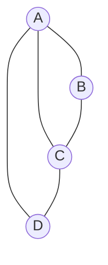

> [!note] 相关
> 📖 解法指南：[[discrete-math/analysis/解法完全指南_v3|解法指南]]
# 离散数学 模拟试卷 B

> **设计思路：** 强化 Ch7（割集/关联矩阵/哈密尔顿必要条件/着色 9分）+ Ch3（包含排斥/笛卡尔积 6分）
> **总分：** 100 分 | **时间：** 120 分钟

---

## 一、不定项选择题（每小题 3 分，共 36 分）

**1.** 下列公式中与 $P \uparrow Q$（与非）等价的是 **【  】**

A. ¬(P∧Q)
B. ¬P∨¬Q
C. ¬P∧¬Q
D. P→¬Q

**2.** "只有刻苦学习，才能取得好成绩"的命题符号化正确的是（P:刻苦学习, Q:取得好成绩） **【  】**

A. P→Q
B. Q→P
C. ¬P→¬Q
D. P↔Q

**3.** 在公式 $\exists x(P(x) \land \forall y Q(x,y)) \to R(x)$ 中 **【  】**

A. 第一次出现的 x 是约束变元
B. Q(x,y) 中的 x 是自由变元
C. R(x) 中的 x 是自由变元
D. y 是自由变元

**4.** 设 A={a,b}, B={1,2,3}，则 |A×B| 和 |B×A| 分别是 **【  】**

A. 6 和 6
B. 6 和 5
C. 5 和 6
D. 6 和 9

**5.** 某班有 50 人，参加数学竞赛的 30 人，参加物理竞赛的 25 人，两科都参加的 10 人。两科都没参加的有多少人？ **【  】**

A. 5
B. 10
C. 15
D. 20

**6.** 设 A={a,b,c}，下列哪个不是 A 的**划分**？ **【  】**

A. {{a,b},{b,c}}
B. {{a},{b},{c}}
C. {{a,b},{c}}
D. {{a,b,c}}

**7.** 在群 ⟨ℤ₆,+₆⟩ 中，元素 [4] 的阶是 **【  】**

A. 2
B. 3
C. 4
D. 6

**8.** 设 G 是 15 阶群，则 G 的子群的阶不可能是 **【  】**

A. 1
B. 3
C. 5
D. 7

**9.** 下图的点连通度 κ(G) 和边连通度 λ(G) 分别是 **【  】**



A. κ=1, λ=1
B. κ=1, λ=2
C. κ=2, λ=2
D. κ=2, λ=3

**10.** 下列哪个图是哈密尔顿图但不是欧拉图？ **【  】**

A. K₄（4个顶点的完全图）
B. K₅（5个顶点的完全图）
C. K₃,₃（完全二分图）
D. C₄（4个顶点的圈）

**11.** 树 T 有 10 个顶点，则 T 的边数是 **【  】**

A. 9
B. 10
C. 11
D. 无法确定

**12.** 对平面图 G 进行正常着色，下列说法正确的是 **【  】**

A. G 的色数 χ(G) ≤ 3
B. G 的色数 χ(G) ≤ 4
C. 若 G 是二分图，则 χ(G)=2
D. 若 G 含奇圈，则 χ(G) ≥ 3

---

## 二、计算题（每小题 8 分，共 32 分）

**13.** 求公式 $(P \lor Q) \to R$ 的主合取范式。

**14.** 设 $A = \{1,2,3,4,6,8,12,24\}$，偏序关系为整除。
(1) 画出偏序集 ⟨A, |⟩ 的哈斯图。
(2) 指出子集 $B = \{4,6,8\}$ 的上界、下界、上确界、下确界。

**15.** 设 ⟨G, *⟩ 是 9 阶群。证明 G 是交换群，并指出 G 可能的同构类型。

**16.** 有向图 G 的邻接矩阵为：

$$A = \begin{pmatrix}
0 & 1 & 0 & 1 \\
0 & 0 & 1 & 0 \\
1 & 0 & 0 & 1 \\
0 & 0 & 0 & 0
\end{pmatrix}$$

(1) 写出 G 的完全关联矩阵。
(2) 求长度为 2 的路的总数和回路的个数。
(3) 求可达性矩阵 P。

---

## 三、证明题（每小题 8 分，共 32 分）

**17.** 利用谓词逻辑推理证明：
$\exists x(P(x) \land Q(x)) \Rightarrow \exists x P(x) \land \exists x Q(x)$

**18.** 设 R 是集合 A 上的关系。证明：R 是传递的当且仅当 $R \circ R \subseteq R$。

**19.** 设 G 是群，H 是 G 的子群。证明：∀a∈G, a⁻¹Ha 也是 G 的子群。

**20.** 设简单连通平面图 G 有 v 个顶点、e 条边。若 G 不含长度为 3 的圈（即无三角形），证明 $e \leq 2v-4$。

---

## 参考答案

### 一、选择题

| 题号 | 答案 | 解析 |
|:--:|:--:|------|
| 1 | **ABD** | NAND: P↑Q=¬(P∧Q)。¬(P∧Q)⇔¬P∨¬Q；P→¬Q⇔¬P∨¬Q |
| 2 | **B** | "只有A才B" ⇔ B→A（A是必要条件） |
| 3 | **AC** | ∃x的辖域是(P(x)∧∀yQ(x,y))，其内x约束；R(x)中x自由；y在∀y辖域内约束 |
| 4 | **A** | \|A×B\|=\|A\|×\|B\|=2×3=6; \|B×A\|=3×2=6 |
| 5 | **A** | \|M∪P\|=30+25-10=45; 未参加=50-45=5 |
| 6 | **A** | A中b同时出现在两个块中→不是划分。BCD各块互不相交且并为A→均是划分 |
| 7 | **B** | [4]的阶：4, 4+4=8≡2, 2+4=6≡0→走了3步。阶=3 |
| 8 | **D** | Lagrange定理：子群阶整除群阶。15的正因子：1,3,5,15。7不整除15 |
| 9 | **C** | 删任1顶点仍连通(检查所有顶点)。删{A,C}后B和D孤立→κ=2。边割：需删(A,C)+(C,D)=2边→λ=2。定理κ≤λ≤δ=2→κ=λ=2 |
| 10 | **AC** | K₄:每点度=3(全奇)→非欧拉。有哈密尔顿回路(K₄有6个)。K₃,₃:每点度=3(全奇)→非欧拉。有哈密尔顿回路a₁-b₁-a₂-b₂-a₃-b₃-a₁ ✓。K₅:度=4全偶→欧拉。C₄:度=2全偶→欧拉 |
| 11 | **A** | 树：e=v-1=10-1=9 |
| 12 | **BCD** | 四色定理：χ≤4。二分图⇔χ=2。奇圈χ≥3。A错(不一定≤3，如K₄需4色) |

### 二、计算题

**13.** 主合取范式（8分）

(P∨Q)→R

真值表（行号按 PQR 编码）：

| P | Q | R | P∨Q | (P∨Q)→R |
|:--:|:--:|:--:|:---:|:--------:|
| 0 | 0 | 0 | 0 | 1 |
| 0 | 0 | 1 | 0 | 1 |
| 0 | 1 | 0 | 1 | 0 |
| 0 | 1 | 1 | 1 | 1 |
| 1 | 0 | 0 | 1 | 0 |
| 1 | 0 | 1 | 1 | 1 |
| 1 | 1 | 0 | 1 | 0 |
| 1 | 1 | 1 | 1 | 1 |

为假的指派：010（M₂）, 100（M₄）, 110（M₆）

主合取范式 = M₂ ∧ M₄ ∧ M₆ = **(P∨¬Q∨R) ∧ (¬P∨Q∨R) ∧ (¬P∨¬Q∨R)**

编码：Π(2,4,6)

**14.** 哈斯图（8分）

(1)（4分）：
```
    24
   / | \
  8  12 |
  | / \ |
  4   6
  |  /
  2 3
   \|
    1
```

(2) B={4,6,8}（4分）：
- 上界：24
- 下界：1, 2
- 上确界：24
- 下确界：2

**15.** 9阶群（8分）

(1) 9 = 3²，由有限群理论，p²阶群(p为素数)必为交换群。(4分)

(2) 可能的同构类型：ℤ₉（9阶循环群）或 ℤ₃×ℤ₃（两个3阶循环群的直积）。(4分)

**16.** 有向图矩阵（8分）

(1) 完全关联矩阵（3分）：
从邻接矩阵得 5 条边：e₁=(v₁,v₂), e₂=(v₁,v₄), e₃=(v₂,v₃), e₄=(v₃,v₁), e₅=(v₃,v₄)
```
    e₁ e₂ e₃ e₄ e₅
v₁   1  1  0 -1  0
v₂  -1  0  1  0  0
v₃   0  0 -1  1  1
v₄   0 -1  0  0 -1
```

(2) 长度2的路（3分）：A² = 
$$\begin{pmatrix}0&0&1&0\\1&0&0&1\\0&1&0&1\\0&0&0&0\end{pmatrix}$$
总和=0+0+1+0+1+0+0+1+0+1+0+1+0+0+0+0=5条路。对角线=0个回路。

(3) 可达性矩阵P（2分）：P = Boolean(A∨A²∨A³)
$$P = \begin{pmatrix}1&1&1&1\\1&1&1&1\\1&1&1&1\\0&0&0&0\end{pmatrix}$$

### 三、证明题

**17.** 谓词推理（8分）

| 步骤 | 公式 | 规则 | 得分 |
|:--:|------|------|:--:|
| (1) | ∃x(P(x)∧Q(x)) | P | — |
| (2) | P(c)∧Q(c) | ES(1) | 2分 |
| (3) | P(c) | T(2)I | — |
| (4) | Q(c) | T(2)I | — |
| (5) | ∃xP(x) | EG(3) | 2分 |
| (6) | ∃xQ(x) | EG(4) | 2分 |
| (7) | ∃xP(x)∧∃xQ(x) | T(5)(6)I | 2分 |

**18.** 传递性 ⇔ R∘R⊆R（8分）

(⇒)若R传递，∀⟨x,y⟩∈R∘R，∃z使⟨x,z⟩∈R且⟨z,y⟩∈R，由传递得⟨x,y⟩∈R。故R∘R⊆R。(4分)

(⇐)若R∘R⊆R，∀⟨x,y⟩∈R且⟨y,z⟩∈R，得⟨x,z⟩∈R∘R⊆R。故R传递。(4分)

**19.** a⁻¹Ha是子群（8分）

(1) 非空：e∈H，故a⁻¹ea=e∈a⁻¹Ha。(2分)
(2) 封闭：∀a⁻¹h₁a, a⁻¹h₂a∈a⁻¹Ha，(a⁻¹h₁a)(a⁻¹h₂a)=a⁻¹h₁h₂a∈a⁻¹Ha。(3分)
(3) 逆元：(a⁻¹ha)⁻¹=a⁻¹h⁻¹a∈a⁻¹Ha。(3分)

**20.** 无三角形平面图（8分）

每个面至少由4条边围成 → 4r ≤ 2e → r ≤ e/2。(3分)

代入欧拉公式 v-e+r=2：v-e+e/2 ≥ 2 → e ≤ 2v-4。(5分)

---

LinAster
SE10009 Discrete Mathematics, CQU
