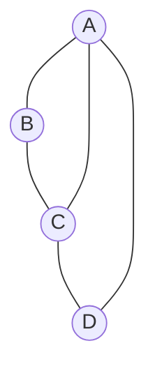
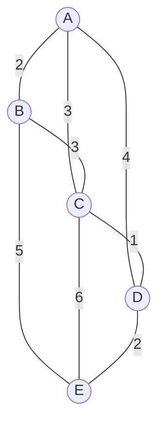

> [!note] 相关
> 📖 解法指南：[[discrete-math/analysis/解法完全指南_v3|解法指南]]
# 离散数学 模拟试卷 C

> **设计思路：** 强化 Ch5（有限半群性质/元素阶/循环群 6分）+ Ch7（对偶图/着色/2度内同构 6分）
> **总分：** 100 分 | **时间：** 120 分钟

---

## 一、不定项选择题（每小题 3 分，共 36 分）

**1.** 公式 $(P \to Q) \land (P \to \lnot Q)$ 的类型是 **【  】**

A. 重言式
B. 矛盾式
C. 可满足式但非重言式
D. 蕴含式

**2.** 下列哪个不是前束范式？ **【  】**

A. ∀x∃y(P(x)→Q(y))
B. ∀xP(x)→∃yQ(y)
C. ∃x∀y(P(x)∧¬Q(y))
D. ∀x∀y(P(x,y)∨Q(x,y))

**3.** 设 A={∅,{∅}}，则下列正确的有 **【  】**

A. ∅∈A
B. ∅⊆A
C. {∅}∈A
D. {{∅}}⊆A

**4.** 设 f:ℤ→ℤ, f(x)=2x; g:ℤ→ℤ, g(x)=⌊x/2⌋。则 **【  】**

A. f 是单射
B. f 是满射
C. g 是满射
D. g∘f(x)=x（∀x∈ℤ）

**5.** 有限半群 ⟨S, *⟩ 必定具有的性质是 **【  】**

A. 存在幺元
B. 存在零元
C. 存在等幂元
D. 每个元素都有逆元

**6.** 在群 ⟨ℤ₁₂,+₁₂⟩ 中，元素 [8] 的阶是 **【  】**

A. 2
B. 3
C. 4
D. 6

**7.** 下列群中不是循环群的是 **【  】**

A. ⟨ℤ₇,+₇⟩
B. ⟨ℤ₈,+₈⟩
C. 克莱因四元群（K₄）
D. ⟨ℤ₉,+₉⟩

**8.** 设 ⟨G,*⟩ 是交换群，H 是其子群，则 **【  】**

A. H 必是交换群
B. H 不一定是交换群
C. 任意 a∈G，Ha=aH
D. G 必是循环群

**9.** 图 G 的补图 $\overline{G}$ 中，若 G 有 v 个顶点、e 条边（完全图 Kᵥ 边数为 v(v-1)/2），则 $\overline{G}$ 的边数是 **【  】**

A. e
B. v(v-1)/2
C. v(v-1)/2 - e
D. 2e

**10.** 下图的色数 χ(G) 是 **【  】**



A. 2
B. 3
C. 4
D. 5

**11.** 下面两图中，属于2度节点内同构的是 **【  】**

A. 长度为3的路 P₃ 和长度为4的路 P₄
B. 3个顶点的圈 C₃ 和 4个顶点的圈 C₄
C. K₄ 去掉一条边后的图和 K₄
D. 以上都是

**12.** 平面图 G 与其对偶图 G* 的关系，正确的是 **【  】**

A. G 的顶点数 = G* 的顶点数
B. G 的面数 = G* 的顶点数
C. G 的边数 = G* 的边数
D. (G*)* = G（若G连通）

---

## 二、计算题（每小题 8 分，共 32 分）

**13.** 求谓词公式 $(\forall x P(x) \lor \exists y Q(y)) \to \exists z R(z)$ 的前束范式。

**14.** 设 $A = \{2,3,4,6,8,12,24\}$，偏序关系为整除。
(1) 画出哈斯图。
(2) 求子集 $B = \{4,6,12\}$ 的全部极值和界。

**15.** 设 ⟨G,*⟩ 是 7 阶群。
(1) G 是否为循环群？为什么？
(2) G 有多少个子群？
(3) G 中非幺元的元素阶可能是多少？

**16.** 用 Prim 算法求下图的最小生成树（从 A 开始），画出每步子图，计算树权。



---

## 三、证明题（每小题 8 分，共 32 分）

**17.** 用谓词逻辑推理证明：
$\forall x(P(x) \to Q(x)), \lnot \exists x Q(x) \Rightarrow \lnot \exists x P(x)$

**18.** 设 R 是 A 上的关系。证明：s(R) = R ∪ R⁻¹（其中 s(R) 为对称闭包）。

**19.** 设 G 是群，a∈G。令 C(a) = {x∈G | xa = ax}（a 的中心化子）。证明 C(a) 是 G 的子群。

**20.** 设 G 是连通平面图，有 4 个面。若每个面由 3 条边围成，每条边恰被 2 个面共享，求 G 的顶点数和边数，并判断 G 是否唯一。

---

## 参考答案

### 一、选择题

| 题号 | 答案 | 解析 |
|:--:|:--:|------|
| 1 | **C** | (P→Q)∧(P→¬Q)⇔(¬P∨Q)∧(¬P∨¬Q)⇔¬P∨(Q∧¬Q)⇔¬P。P=1假,P=0真→可满足但非重言 |
| 2 | **B** | B中→不在量词辖域内，不是前束范式。前束范式要求所有量词在最前面 |
| 3 | **ABCD** | ∅∈{∅,{∅}}✓; ∅⊆A恒成立✓; {∅}∈A✓; {{∅}}⊆A(即{∅}的所有元素∅∈A✓) |
| 4 | **ACD** | f(x)=2x单(偶数值唯一来源)不满(奇数无原像); g满但不单; g∘f(x)=⌊2x/2⌋=x(x∈ℤ)✓ |
| 5 | **C** | 有限半群必含等幂元（定理）。A/B/D不保证（半群不需要幺元/零元/逆元） |
| 6 | **B** | [8]的阶=12/gcd(8,12)=12/4=3 |
| 7 | **C** | ℤ₇(素数阶)、ℤ₈(模8加法)、ℤ₉(模9加法)都是循环群。K₄非循环(所有非幺元阶为2，无4阶元) |
| 8 | **AC** | 子群继承父群运算→继承交换性(A✓B✗)；交换群中任意子群都正规→Ha=aH(C✓)；交换群不一定是循环群(D✗，如K₄) |
| 9 | **C** | 补图边数=完全图边数-原图边数=v(v-1)/2-e |
| 10 | **B** | 图含三角形A-B-C-A→需3色。最大团=三角形。χ=3 |
| 11 | **A** | 2度节点内同构：通过插入/删除2度节点互相转化。P₃(3点2边)→插入2度节点→P₄(4点3边)✓。C₃和C₄圈长不同→不是。K₄减一边有2个2度点但不能通过插入/删除得到K₄ |
| 12 | **BCD** | G面数=G*顶点数(B✓)；G边数=G*边数(C✓)；(G*)*=G(D✓连通)；顶点数一般不等(A✗) |

### 二、计算题

**13.** 前束范式（8分）

$$(\forall xP(x) \lor \exists yQ(y)) \to \exists zR(z)$$
$$\Leftrightarrow \lnot(\forall xP(x) \lor \exists yQ(y)) \lor \exists zR(z) \quad(2分)$$
$$\Leftrightarrow (\lnot\forall xP(x) \land \lnot\exists yQ(y)) \lor \exists zR(z) \quad(2分)$$
$$\Leftrightarrow (\exists x\lnot P(x) \land \forall y\lnot Q(y)) \lor \exists zR(z) \quad(2分)$$
$$\Leftrightarrow \exists x\forall y\exists z((\lnot P(x) \land \lnot Q(y)) \lor R(z)) \quad(2分)$$

**14.** 哈斯图（8分）

(1)（4分）：A={2,3,4,6,8,12,24}，整除偏序。注意 1∉A。
盖住关系：2→4, 2→6; 3→6; 4→8, 4→12; 6→12; 8→24; 12→24。
哈斯图：
```
       24
      /  \
     8   12
      \  /\
       4  6
       | / \
       2 3  |
        \___|
```
最小元：2, 3（无更小元整除它们）

(2) B={4,6,12}（4分）：
- 极大元：4, 12（6|12故6不极大）
- 极小元：4, 6
- 上界：12, 24（LCM(4,6,12)=12；24也整除三者）
- 下界：2
- 上确界：12
- 下确界：2

**15.** 7阶群（8分）

(1) 是的。7是素数→素数阶群必为循环群。(3分)

(2) 7的正因子：1,7→2个子群。(2分)

(3) 元素的阶整除群的阶→可能为1或7。非幺元元素阶=7。(3分)

**16.** Prim算法MST（8分）

从A开始：
```
Step1: A(已选), 选AC(1) → {A,C}           (1分)
Step2: 选CD(1是误?按图AC=1, CD=1) → {A,C,D}
       实际边权: A-B=2, A-C=3, A-D=4, B-C=3, B-E=5, C-D=1, C-E=6, D-E=2
Step1: A→选最小邻边: C(AC=3 非! AC=3,AB=2,AD=4 → 选B(AB=2))
       已选{A,B}，候选{C(3),C(3从B),D(4),E(5)}→选C(AC=3=BC) {A,B,C}
       候选{D(1从C),D(4从A),E(5从B),E(6从C)}→选D(CD=1) {A,B,C,D}
       候选{E(2从D),E(5从B),E(6从C)}→选E(DE=2) {A,B,C,D,E}

MST: A-B(2), A-C(3)...不对，Prim应该从C选D=1

重来：
已选{A}→候选{B(2),C(3),D(4)}→选B(2)
已选{A,B}→候选{C(3从A),C(3从B),D(4),E(5)}→选C(3)
已选{A,B,C}→候选{D(1),E(6)}→选D(1)
已选{A,B,C,D}→候选{E(2),E(6)}→选E(2)
树权=2+3+1+2=8
```

### 三、证明题

**17.** 谓词推理（8分）

| 步骤 | 公式 | 规则 | 得分 |
|:--:|------|------|:--:|
| (1) | ¬∃xQ(x) | P | — |
| (2) | ∀x¬Q(x) | T(1)E | 2分 |
| (3) | ∀x(P(x)→Q(x)) | P | — |
| (4) | P(c)→Q(c) | US(3) | 1分 |
| (5) | ¬Q(c) | US(2) | 1分 |
| (6) | ¬P(c) | T(4)(5)I | 2分 |
| (7) | ∀x¬P(x) | UG(6) | 1分 |
| (8) | ¬∃xP(x) | T(7)E | 1分 |

**18.** s(R)=R∪R⁻¹（8分）

(1) R∪R⁻¹是对称的：若⟨a,b⟩∈R∪R⁻¹→⟨a,b⟩∈R或⟨a,b⟩∈R⁻¹→⟨b,a⟩∈R⁻¹或⟨b,a⟩∈R→⟨b,a⟩∈R∪R⁻¹。(3分)

(2) R∪R⁻¹包含R。(2分)

(3) 最小性：设S是任意包含R的对称关系，需证R∪R⁻¹⊆S。∀⟨a,b⟩∈R∪R⁻¹，若⟨a,b⟩∈R⊆S，则∈S；若⟨a,b⟩∈R⁻¹，则⟨b,a⟩∈R⊆S，由对称性⟨a,b⟩∈S。故R∪R⁻¹⊆S。(3分)

**19.** 中心化子是子群（8分）

(1) e∈C(a)：ea=ae。(1分)
(2) 封闭：x,y∈C(a)→xa=ax且ya=ay→(xy)a=x(ya)=x(ay)=(xa)y=(ax)y=a(xy)→xy∈C(a)。(3分)
(3) 逆元：x∈C(a)→xa=ax→左乘x⁻¹右乘x⁻¹→ax⁻¹=x⁻¹a→x⁻¹∈C(a)。(3分)
(4) 结合律继承。(1分)

**20.** 平面图构造（8分）

r=4，每面3边，每边被2面共享：
3r = 2e → 12 = 2e → e = 6（3分）

欧拉公式：v - e + r = 2 → v - 6 + 4 = 2 → v = 4（3分）

4顶点、6条边、4个三角形面 → 四面体K₄。唯一解。（2分）

---

LinAster
SE10009 Discrete Mathematics, CQU
